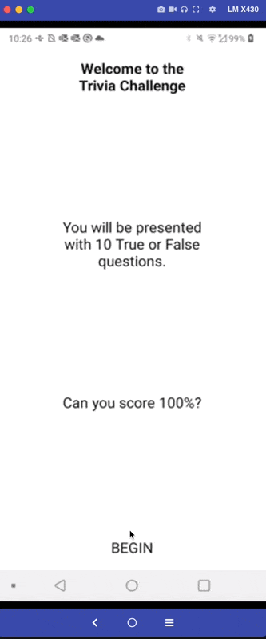
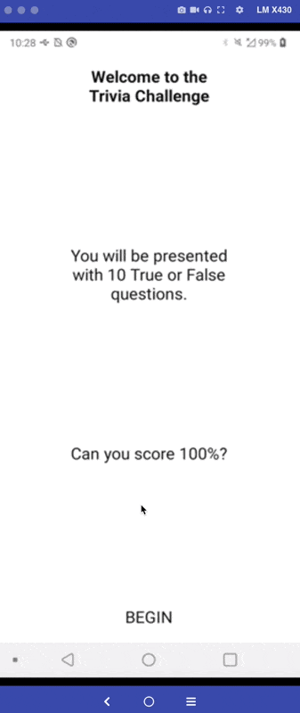

# G2i Code Challenge - Quiz Project

### [Download Android App for test!](https://github.com/marcelochb/g2i-hiring-test-rn/blob/master/apk/app-release.apk?raw=true)




### Technologies used

- React Native
- Typescript
- Redux
- Tsyringe (inject dependency to clean architecture)
- Axios
- Jest (unit test)
- Detox (e2e test)

## Project structure

```
Project
├── __tests__
|   ├── modules
│   │   ├── quiz
│   │   │   ├── domain: Usecase unit test.
│   │   │   ├── external: Datasource unit test.
│   │   │   ├── infra: Repository unit test.
├── e2e
|   ├── actions: Actions page elements
|   ├── flows: Flow Actions
|   ├── pages: Page elements
├── src
|   ├── assets: Application images, videos, gifs and others.
│   ├── core: Tools used by all project.
│   │   ├── components: App main react components.
│   │   ├── config: General configuration.
│   │   │   ├── store: Main state control (Redux).
│   │   │   ├── typescript: Declarations class.
│   │   ├── constants: Inject dependency and state control.
│   │   ├── routes: React Navigation config.
│   │   ├── services: Api service (axios).
│   │   ├── themes: Theme config.
│   ├── modules: Project's modules.
│   │   ├── quiz: Quiz module.
│   │   │   ├── domain: Entities, Usecases and Repositorie's interface.
│   │   │   ├── external: Datasources.
│   │   │   ├── infra: Repositories, Models and Datasources' interface.
│   │   │   ├── presenter: Screens, binds and store.
│   │   │   │   ├── binds: Inject dependecy of module.
│   │   │   │   ├── screens: Home, question and result screens.
│   │   │   │   │   ├── home: View, controller (hooks) and style.
│   │   │   │   │   ├── question: View, controller (hooks) and style.
│   │   │   │   │   ├── result: View, controller (hooks) and style.
│   │   │   │   ├── store: Reducer and actions.
│   ├── index.tsx: Main application component.
|
├── tsconfig.json: Typescript compiler configurations
├── package.json: File that manages all the dependecies and contains script definitions.

```

### How to build and run

- `yarn`
- `npx react-native run-android`
- `cd ios && pod install && cd ..`
- `npx react-native run-ios`

### How to run integration test

- `brew update && brew install node`
- `brew tap wix/brew;brew install applesimutils;`
- `npm install -g detox-cli`
- `detox build && detox test`

# G2i React Native Code Challenge - Trivia App

Your challenge is to create a 10 question, true or false, trivia app with React Native.

The application code will be reviewed and scored on these key areas with many subset areas for each:

- Functionality
- Code Format
- Project Structure
- Scalability
- Maintainability
- Use of industry best practices

Specifications

Use the Expo CLI to create a managed Expo App.

The api url is: https://opentdb.com/api.php?amount=10&difficulty=hard&type=boolean

Sample returned json:

{
"response_code": 0,
"results": [
{
"category": "Entertainment: Video Games",
"type": "boolean",
"difficulty": "hard",
"question": "Unturned originally started as a Roblox game.",
"correct_answer": "True",
"incorrect_answers": [
"False"
]
},…]}

Intro / Home Screen:

 

Static Text
BEGIN button navigates to the Quiz screen and starts the Quiz

Quiz Screen:


The headline is from question category
The card element contains the current question
The next question should appear after the current question is answered True or False
After all questions have been answered, navigate to the Results Screen

Results screen:


The Score shows correct and total
Displays a list of the questions and whether the answer was correct or not
PLAY AGAIN starts over and navigates to the Home Screen

What Do We Expect From You

Complete the challenge requirements stated above.
Implement an organised and easily understandable React code following best practices
Choose the correct React Native APIs to create your App.
Include clear instructions and requirements for how to run the app in a Development environment.
Follow JavaScript best practices

Best Practices We Will Check For

Code Style Practices https://github.com/goldbergyoni/nodebestpractices#3-code-style-practices
Uses async-await or promises for async error handling https://github.com/goldbergyoni/nodebestpractices#-21-use-async-await-or-promises-for-async-error-handling
Use only built-in error object https://github.com/goldbergyoni/nodebestpractices#-22-use-only-the-built-in-error-object
Always awaits promises https://github.com/goldbergyoni/nodebestpractices#-212-always-await-promises-before-returning-to-avoid-a-partial-stacktrace
Handling of API Errors
Follow clear naming convention - https://github.com/kettanaito/naming-cheatsheet
Handle navigation and routing properly
Follow the principles of thinking in React https://reactjs.org/docs/thinking-in-react.html
JavaScript best practices - https://exploringjs.com/deep-js/toc.html and https://exploringjs.com/impatient-js/toc.html
Separation of concerns between UI, Server Data, Business Logic - https://khalilstemmler.com/articles/client-side-architecture/introduction/
Declarative style of programming - for inspiration https://betterprogramming.pub/write-delightful-declarative-javascript-a83c91111e12.',
UI Responsiveness & User Experience.
React Native's Design best practices - see entire Design section in the docs https://reactnative.dev/docs

⬢ G2i React Native Technical Interview

This is an on average 45 minutes long interview with another React Native developer who will ask you high-level questions or specific questions about code snippets. You will be requested to write some small snippet of code and explain problems or how you would normally solve a problem related to JavaScript, React and React Native.

We will request you to enable your camera, so please make sure you are in an appropriate place and ready for such event. Before getting started make sure you test your mic and camera with the Zoom app. If possible prefer to use a headphone with a mic to ensure the audio quality is good.

We request that you create an account with Repl.it before the interview since we will use it as a playground for us to share code snippets. https://replit.com

During the interview there is a small challenge, which is we request you to make a commit to a remote repository we have by doing the following task:

What Do You Need To Do For The Interview?

Be ready to answer any JavaScript, React, React Native, Front-End, and Software Engineering topic questions.

Further Information

What kind of information are we trying to get from you with our interview questions?

How well can you communicate technical ideas?
How much do you know JavaScript?
What is your production experience with building React Native applications?
How much do you know about React Native's architecture
Can you figure out common error messages?
Can you contribute to remote repositories in Github?
And how confident we feel about you.

What are some possible resources I can use to get ready?

JavaScript and its best practices https://exploringjs.com/impatient-js/index.html
How to work with React, make sure you have gone through the main concepts section https://reactjs.org/docs/getting-started.html
How to work with React Native https://reactnative.dev/docs/getting-started
Be ready to talk about your previous experience with React Native and what you have built.
